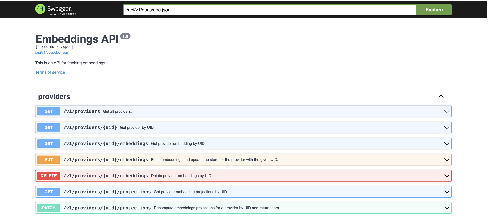

# embeviz

A simple webapp for visualizing text embeddings.

> [!WARNING]
> THIS PROJECT IS WILDLY EXPERIMENTAL AT THE MOMENT! USE AT YOUR OWN RISK!

[](https://github.com/milosgajdos/embeviz/actions?query=workflow%3ACI)
[](https://pkg.go.dev/github.com/milosgajdos/embeviz)
[](https://opensource.org/licenses/Apache-2.0)

The app consists of two components:
* A JSON API (written in Go, using [gofiber framework](https://docs.gofiber.io/))
* An SPA (written in JavaScript using [ReactJS](https://react.dev/) framework with [React Router](https://reactrouter.com/en/main))

The SPA is available on the `/ui` URL path when running the app.
The app also exposes the API docs on `/api/v1/docs` URL.

> [!IMPORTANT]
> Before you attempt to access the SPA you must build it first!
> See the [README](./ui/README.md) for more details.

<p align="center">
  
&nbsp; &nbsp; &nbsp; &nbsp;
  
</p>

The [swagger](https://swagger.io/) docs for the API are availble on `/api/v1/docs`.

<p align="center">
  
&nbsp; &nbsp; &nbsp; &nbsp;
  
</p>

The app leverages the [go-embeddings](https://github.com/milosgajdos/go-embeddings) Go module for fetching embeddings from various API providers like [OpenAI](https://openai.com/),
and chunking the input data if requested.

As a result of this you **MUST** supply API keys to the embeddings providers via environment variables when you run the app.
See the [`README`](https://github.com/milosgajdos/go-embeddings) of the `go-embeddings` module for more details.

> [!WARNING]
> By default the API stores the embeddings in an in-memory store (which is a major Go maps hack!).
> The only vector store currently supported is [qdrant](https://qdrant.tech/). See the [docs](./api/v1/qdrant).

# Build

Build the UI:
```shell
cd ui && npm install && npm run build
```

> [!IMPORTANT]
> You must build the UI app first as the Go binary [embeds](https://pkg.go.dev/embed) it as a static asset.

Build the Go binary:
```shell
go get ./... && go build
```
## Nix

The project also provides a simple `nix` flake that leverages [gomod2nix](https://github.com/nix-community/gomod2nix) for consistent Go environments and builds.

To get started just run
```shell
nix develop
```

And you'll be dropped into a development shell.

> [!NOTE]
> `gomod2nix` vendors dependencies into the local `nix` store so every time you add a new dependency you **must** run `gomod2nix generate` which updates the `gomod2nix.toml` file based on your `go.mod`/`go.sum`.

# Run

> [!IMPORTANT]
> Before you run the app you need to make sure you have set some environment variables required by specific AI embeddings providers. See the list below for the currently supported providers:

The project relies on the [go-embeddings](https://github.com/milosgajdos/go-embeddings) Go module so we only support specific AI embeddings API providers:
* [OpenAI](https://openai.com/): `OPENAI_API_KEY`
* [Cohere](https://cohere.com/): `COHERE_API_KEY`
* [Google VertexAI](https://cloud.google.com/vertex-ai/docs/generative-ai/learn/overview): `VERTEXAI_TOKEN` (get it by running `gcloud auth print-access-token` once you've set up your GCP project and authenticated locally) and `GOOGLE_PROJECT_ID` (the ID of the GCP project)

> [!NOTE]
> If none of the above environment vars has been set, no AI embeddings provider is loaded and you won't be able to interact with the app.
> The project doesn't allow adding new embeddings providers from the UI app at the moment.

Once you've bundled the webapp and built the Go binary you can run the following command:
```shell
OPENAI_API_KEY="sk-XXXX" COHERE_API_KEY="XXX" ./embeviz
```
Alternatively you can also run the following commands, which installs node dependencies and builds the app on the fly:
```shell
npm --prefix ui install \
     && go generate ./...  \
     && OPENAI_API_KEY="sk-XXXX" COHERE_API_KEY="XXX" go run ./...
```

You should now be able to access the SPA on [http://localhost:5050/ui](http://localhost:5050/ui).

The API docs should be available on [http://localhost:5050/api/v1/docs](http://localhost:5050/api/v1/docs).

# TODO

* [ ] Clean up the code: both Go and especially React/CSS
* [ ] Add a text chunk hihglighter
